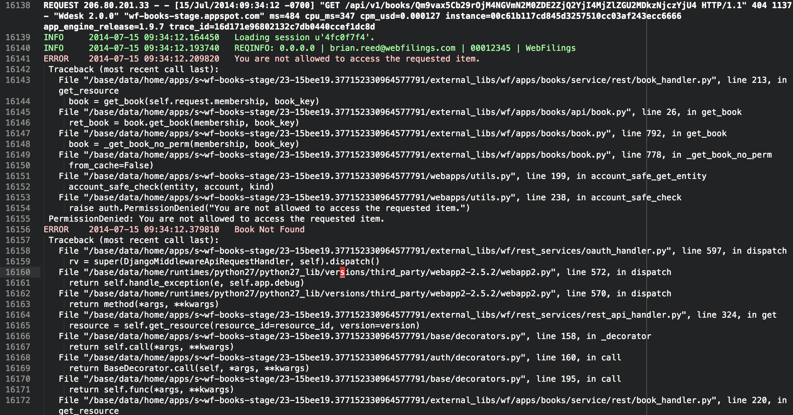

#sublime-appengine-logs
A simple log formatter and accompanying sublime language/theme.  Inspired by Michael Davis's [runservery.py script](https://github.com/michaeldavis-wf/scripts)

##Install Instructions
1.  Clone this repo locally
2.  Open sublime text 3 (will probably also work in 2)
3.  There should be a "Browse Packages" menu option under Sublime Text -> Preferences.  Click this.
4.  Copy the AppEngineLog folder to this directory (the Packages directory)
5.  You should also see a 'User' folder.  Open it.
6.  Copy appengine.tmTheme and appenginelog.sublime-settings to the 'User' folder.

##Usage Instructions
First you will need to request logs from the appspot and module you want to examine.  Official instructions can be found [here](https://developers.google.com/appengine/docs/python/tools/uploadinganapp#Python_Downloading_logs), but I generally find querying appcfg.py request_logs --help to be more useful.  The command I use most often is:

**Format:** 
*appcfg.py request_logs -A [appspot] -V [version] --module [module] --severity=[severity level 1-4] -n [number of days] -v --include_all --noisy [output file]*

**Example:** 
*appcfg.py request_logs -A wf-books-stage -V 23-15bee19 --module default --severity=3 -n 2 -v --include_all --noisy test_logs.txt*
   
Once you have a log file, use format_logs.py to convert the file to a .appenginelog file like so:

*python format_logs.py test_logs.txt --output test_logs.appenginelog*

If you do not specify the output option the logs will print to the terminal (also useful).  To both print to the terminal and output to an appenginelog file, add the --print option:

*python format_logs.py test_logs.txt --output test_logs.appenginelog --print*
   
Now that you have a .appenginelog file, open it with Sublime Text.  If you do not see colored log files, you may have to set the first .appenginelog syntax specifically.  To do this click the menu option View -> Syntax -> AppEngineLog.  
